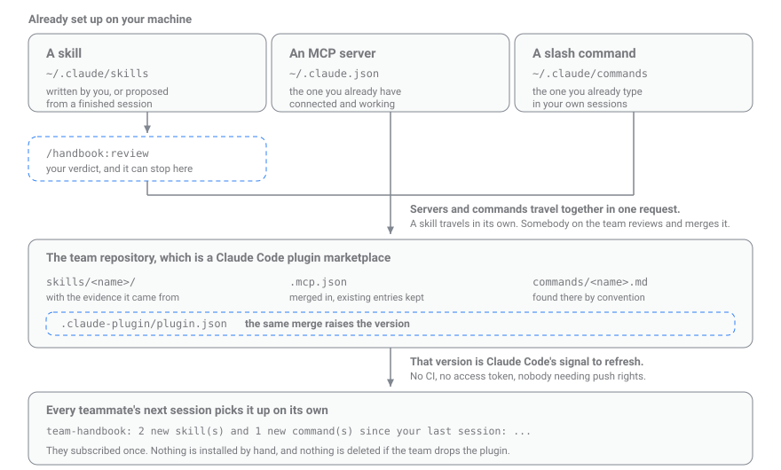

# TeamHandbook

**The team handbook that writes itself.**

You explain a rule to Claude. So do four teammates, in four other sessions. Five lessons
learned, and each one stays with the person who learned it. It should be five lessons
the whole team has.

TeamHandbook works in the background of every session - noticing the rule the moment you
type it, the command that failed, the fix that followed. When the session ends it turns
what it saw into one question:

```
handbook learned from your last session: "no-db-mocks-in-integration-tests"
(correction, 8/10) - run /handbook:review
```

Nothing is kept until you answer. When you do, you choose who gets it:

- **just you** - loads in every project you open, goes no further
- **this repo** - committed next to the code, for anyone who works on it
- **the whole team** - a pull request to your handbook repo: everyone, every project

**That third one is where it compounds.** Five developers, one lesson each a week: by
Friday all five are working with five, and four of them were learned by somebody else.
You stop improving at the speed of your own mistakes and start improving at the speed of
your team's. Whoever joins next month starts there too, on their first day.

## Install

**Requires** Claude Code ≥ 2.1 and Node.js ≥ 18.

```
/plugin marketplace add AhmetErenLapanta/TeamHandbook
/plugin install handbook@teamhandbook
```

Choose **"Install for you (user scope)"** when Claude Code asks: repeats are counted
across all your projects, so scoping it to one repository hides the thing it looks for.
Not project scope, which installs it for everyone who clones the repo
([why](SECURITY.md#install-it-for-yourself-not-for-your-teammates)).

That's the whole install. It works **solo immediately** - no team setup required.

## Nothing ships until you say so

`/handbook:review` shows each lesson with the evidence that produced it - your own
words, the failing command, the fix:

```
candidate: no-db-mocks-in-integration-tests  [correction]  [scope: team]  [pending]
score:     8/10  (recurrence 1, unfindability 2, generality 2, durability 2, costOfError 1)

── grounded case ──
you said:  "we never mock the DB in integration tests here - use the testcontainer fixture"
expect:    Integration tests start a testcontainer instead of a mock.
```

Then you choose where it lives:

```
/handbook:review approve <slug> --to personal   # ~/.claude/skills - every project, just you
/handbook:review approve <slug> --to project    # this repo's .claude/skills - travels with the code
/handbook:review approve <slug> --to team       # a pull request to your team's handbook
```

## Commands

| Command | What it does |
|---|---|
| `/handbook:review` | Keep, scope, share, edit, or reject each lesson. **The only way anything ships.** |
| `/handbook:demo` | Walk the whole loop in two minutes on a scratch project. |
| `/handbook:learn` | Capture something on demand instead of waiting for the session to end. |
| `/handbook:status` | Queue, ledger, how often your skills actually fired, config. |
| `/handbook:doctor` | Diagnose node, the `claude` CLI, hooks, config, team repo. |
| `/handbook:init` | Scaffold the team handbook repo and print the join command. |
| `/handbook:join <url>` | Point at an existing team handbook. |
| `/handbook:leave` | Back to solo. Deletes no skills. |

## How it works



- **Capture is a hook, not a tool call.** The model won't remember to save a lesson at
  the worst moment - a failing build, a frustrated developer. Hooks fire every time.
- **A free check decides whether the model runs at all.** A trivial session - a
  question, a couple of `ls` calls - is never harvested and costs nothing.
- **Five criteria**, 0-2 each: recurrence, unfindability, generality, durability, cost
  of error. A lesson needs **≥4/10** to reach your queue, and at most the top three per
  session do. The score decides what is worth *asking about*, not what ships.
- **Every skill carries its receipt**: your quoted words, the failing command, the fix,
  so you can judge it in seconds instead of trusting it.

The output is a spec-compliant [Agent Skill](https://agentskills.io). Delete
TeamHandbook tomorrow and your skills keep working, in any tool that reads `SKILL.md`.

## Privacy

To find the lesson, TeamHandbook sends a slice of the finished session to **your own**
`claude` CLI - no bundled key, no third-party model, no telemetry. Exactly what is read,
what is never read, and every file it writes: [SECURITY.md](SECURITY.md).

Turn it off in `~/.teamhandbook/config.json`:

```jsonc
{ "harvest": { "enabled": false } }   // no session is ever read or sent
{ "gate":    { "auto": false } }      // no automatic model calls at all
```

Both fail **closed** if the file cannot be parsed. Secrets are redacted before anything
is written or sent, though detection is pattern matching - eyeball a candidate before
approving it.

## Sharing it with your team

The team handbook is just a git repo. One person creates it:

```
/handbook:init
```

That prints the one command everyone else runs:

```
/handbook:join <repo-url>
```

From then on, an approved lesson arrives as an ordinary pull request - reviewed like
code, merged like code, and delivered by Claude Code's own marketplace.

Teammates who only want to *read* the handbook don't need this plugin at all:

```
/plugin marketplace add <team-repo-url>
/plugin install <team-plugin-name>
```

If your team drops TeamHandbook tomorrow, the handbook repo and its distribution keep
working. There is no lock-in.

## Honest limitations

- **The harvest is one model call, and the model matters.** On an identical prompt from
  a real session the default (`sonnet`) proposed the developer's stated rule 3 times out
  of 3; `haiku` managed 1 in 3. A lesson buried in a very long session can still be
  missed, and the model can propose something plausible but wrong - which is exactly why
  nothing installs itself.
- **A correction needs you to have said it.** Fix Claude's approach by editing the file
  yourself and there is nothing to quote.
- **Only conversational prose is read.** A lesson living purely in tool output reaches
  the harvest only through the deterministic error→fix pairs the hooks captured.
- **Repeat matching is word overlap, not understanding.** Two phrasings of one rule
  match when they share most of their content words, and a word wearing a different
  suffix still counts as the same word - so it works whatever language you teach in,
  including one where every ending changes. A rule restated in completely different
  words reads as new. The bias is deliberate: a missed repeat, never a false one.
- **State is per-machine.** `~/.teamhandbook/` does not sync; team approvals travel
  through the merged pull request.

## Development

```
npm install
npm run build       # bundle the hooks into dist/
npm test
npm run typecheck
```

`dist/` is committed on purpose: the plugin is installed by git clone, so the built
hooks must be present.

## License

[Apache-2.0](LICENSE).
