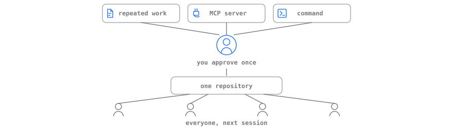

# TeamHandbook

[](https://github.com/AhmetErenLapanta/TeamHandbook/actions/workflows/ci.yml) [](LICENSE) [](package.json)

**The work your repository keeps repeating, written down as skills your whole team has.**
TeamHandbook reads your git history, finds the jobs that change the same files the same way
time after time, and drafts a skill for the one you pick. One person approves it in review,
it lands in the repository, and the team has it from their next session.

[The first day](#the-first-day) · [What a draft is](#what-a-draft-is) · [Install](#install) ·
[Who approves what](#nothing-ships-until-you-say-so) ·
[Why you might not want this](#why-you-might-not-want-this)



## The first day

One person sets up the team's repository, once, with `/handbook:init`. Everyone else keeps
working where they already work.

In any repository, `/handbook:mine` lists the work its history repeats: the files each
piece of work touches, how often it was done, and by how many people. Listing reads git and
nothing else, so it makes no model call and sends nothing. Pick one with
`/handbook:mine draft <n>` and TeamHandbook writes a draft skill from that one workflow's
screened evidence, through your own `claude` CLI. The draft waits in `/handbook:review`,
where you read it, fill in what it could not know, and decide where it goes. Adding it to
the project writes it into that repository's `.claude/skills/` and commits it, once you
have approved the commit message; push it like any other commit, and everyone who pulls
has it at their next session. Sharing it with the team opens a merge request on the team's
repository instead.

## What a draft is

A draft is not a finished skill, and it does not pretend to be one. It carries:

- **a skeleton of the steps**, in the order the past changes took them;
- **a file map the history measured**: the files the work touches, and how consistently;
- **what the history could not show**, listed as open questions. Much of any job never
  reaches git, so the draft asks rather than guesses, and you answer at review.

[A draft mined from an open-source repository's history](docs/examples/change-cache-backend-api/SKILL.md)
shows the first two on real work ([where it came from](docs/examples/README.md)).
`/handbook:demo` walks the whole path on a scratch repository without calling a model.

## What reaches your team

TeamHandbook is a Claude Code plugin, and besides the drafts it writes from history it
makes one git repository your team's shared setup: the skills, MCP servers and slash
commands everybody should have. That repository is a Claude Code plugin marketplace, so
Claude Code itself does the delivering. Merge a request there and each teammate's copy
picks it up at their next session: no CI, no access token, and nobody needing push rights
on a protected branch.

| What you share | Command | Where it lands |
|---|---|---|
| A draft from your repository's history | `/handbook:review` | that repository's `.claude/skills/<name>/`, committed once you approve the message; or the team repository's `skills/<name>/` |
| A skill you wrote yourself | `/handbook:share` | the team repository's `skills/<name>/`, with every file it carries |
| An MCP server already configured on this machine | `/handbook:share` | an entry in the team repository's `.mcp.json` |
| A slash command already installed on this machine | `/handbook:share` | the team repository's `commands/<name>.md`, or `commands/<dir>/<name>.md` for one in a subdirectory |

Everything that goes to the team repository travels as a merge request that raises its
plugin version. That version is Claude Code's signal that the plugin moved, which is what
makes every teammate's copy refresh. A draft added to its own project travels the way the
code does: commit, push, pull.

Nothing else is automated, and the repository is an ordinary plugin repo: agents and
hooks can be committed to it by hand and reach everyone the same way, as long as the
version is raised in the same commit. `/handbook:init --with-ci` scaffolds a job that
does that on merge, for teams who work that way.

If your team drops TeamHandbook tomorrow, the repository and its distribution keep
working: there is no lock-in.

## Install

**Requires** Claude Code >= 2.1 and Node.js >= 22.

### Setting it up for your team

One person, once.

```
/plugin marketplace add AhmetErenLapanta/TeamHandbook
/plugin install handbook@teamhandbook
```

Choose **"Install for you (user scope)"** when Claude Code asks, not project scope, which
installs it for everyone who clones the repo
([why](SECURITY.md#install-it-for-yourself-not-for-your-teammates)).

Restart Claude Code so the hooks load, then:

```
/handbook:init
```

Give it an empty git repository or let it create one, and it lays the marketplace
scaffold into that repo. If the repo already has commits, the scaffold arrives as a merge
request and nothing is live for anyone until a human merges it. A repository with no
commits at all has no branch to open a request against, so there the scaffold goes
straight to the default branch. Either way, files that are already there are kept.

Three commands and a restart. `init` asks at least two questions: which repository to
use, and a confirmation before it writes. More if it creates the repo, and a branch or
commit prefix if the forge rejects either. Its output ends with your team's message; read
it first: each teammate needs repo access and git credentials they set up themselves.

### Joining one your team already has

```
/plugin marketplace add AhmetErenLapanta/TeamHandbook
/plugin install handbook@teamhandbook
```

Same user-scope choice, same restart. Then:

```
/handbook:join <team-repo-url>
```

That clones the repo to check it and records it as where your approved skills will go. It
does not connect Claude Code to anything. It prints two more commands, and you are the
one who runs them:

```
/plugin marketplace add <team-repo-url>
/plugin install <team-plugin-name>@<team-plugin-name>
```

Five commands and a restart. Those last two are what brings merged skills to this
machine. Stop after `/handbook:join` and you can still share your own work; you just will
not receive anyone else's.

### Only receiving the handbook

If you want the team's skills and never intend to contribute your own, you do not need
this plugin at all:

```
/plugin marketplace add <team-repo-url>
/plugin install <team-plugin-name>@<team-plugin-name>
```

Two commands, and whoever set the repository up can send them to you already filled in:
`/handbook:init` prints that message for them. The team's own plugin carries a small hook
that tells you when new skills, servers, or commands have landed.

### Check the install

`/handbook:doctor` reports node, the `claude` CLI TeamHandbook shells out to, whether the
hooks are firing, your git identity, the config, and the team repo, with a fix for each
failure it finds. Run it before the restart and it reports the hooks as not firing,
correctly: they are not, yet.

## Nothing ships until you say so

Two decisions hide behind that sentence, and each one belongs to the person it affects.

### What leaves your machine

`/handbook:review` shows each draft with what it was written from - for a draft from
history, its file map and the questions it could not answer - and then asks where it goes:

- **Share with the team** - a merge request to the handbook repo: everyone, every project
- **Add to the project it came from** - that project's `.claude/skills`, named in the
  question. A draft from history is committed there for you, once you approve the commit
  message; anything else is copied there for you to commit. A skill installs where it came
  from, not whichever project you are reviewing from
- **Keep for yourself** - `~/.claude/skills`: every project you open, nobody else
- **Reject** - not worth keeping

You can also ask for an edit before deciding, or leave one pending and come back. Nothing
TeamHandbook wrote moves anywhere without that verdict, and the answer that sends it to the
team ends in a merge request somebody reviews. A skill you wrote yourself has no verdict to
wait for: you pick it on the `/handbook:share` screen, and that picking is the approval.

### What arrives on your machine

Nobody can put anything on your machine from the handbook repo. You subscribe yourself,
with the two `/plugin` commands above. Whoever set the repository up cannot do it for
you and cannot write to your `~/.claude`; what they can do is merge things into a
repository you chose to subscribe to.

That subscription is standing, not item by item. A merged skill, MCP server, or slash
command raises the repository's plugin version, Claude Code refreshes on that, and it is
there at your next session. The team plugin prints what landed ("2 new skill(s), 1 new
MCP server(s), and 1 new command(s) since your last session"), so a server or a command
never arrives in silence.

If you would rather see each change before it reaches you, do not subscribe: the skills
are plain directories you can read in the repo and copy. `/plugin marketplace remove
<team-plugin-name>` ends a subscription you already have. `/handbook:leave` is a separate
thing: it drops the contribution target and leaves the subscription alone.

## Why you might not want this

- **You are working alone.** It runs solo, and approved skills land in `~/.claude/skills`
  or the project with no team repo involved. The payoff is other people: a draft approved
  once is worth most when the people who repeat that work read it too.
- **A draft is a start, not a skill.** Much of any job never reaches git - the reason, the
  conversation, the check somebody ran by hand - and the draft can only list that as open
  questions. Expect to answer them before approving.
- **A young repository has nothing to find.** It takes several jobs that touched the same
  files before the same work can be recognised twice. A repository whose commits each do
  something different lists nothing, and that is the right answer.
- **Drafting is one model call, and the reply is held to a standard.** A draft that fails
  the format check or the screen is dropped rather than repaired, so asking can come back
  with nothing kept: ask again, or pick another. The model can also write something
  plausible but wrong, which is why nothing it writes installs itself.
- **The screen is pattern matching.** Secrets, traces of this machine and the names of the
  people who did the work are screened out of what is sent and of what comes back, but a
  secret in a format the detector does not know, or a part of a name common enough in the
  code to read as a word, can get through. Read a draft before approving it;
  [SECURITY.md](SECURITY.md#what-handbookmine-reads-and-sends) says where the limits are.
- **A private handbook has a setup step you cannot automate away.** Every teammate needs
  access to the repository and git credentials on their own machine, and that is a
  one-time interactive sign-in they run in their own terminal. A plugin can never stop to
  ask for a password, so without it the commands fail with a bare git error.
- **State is per-machine.** `~/.teamhandbook/` does not sync; team approvals travel
  through the merged request.

## How it works


- **One merge request for a whole selection.** Everything you pick travels together,
  skills included, because each one raises the version and two requests opened before
  either is merged claim the same number. One clone, one bump, one request.
- **The commit says what you said.** TeamHandbook never commits with a message you have not
  seen; you can delegate the wording only at the moment the merge request is opened, and
  only for the exact sentence you were shown. Where no request can be opened - an empty
  repository, a draft committed into its own project, or a machine with no `gh`/`glab`
  signed in - the wording is yours to give.
- **The version bump is the delivery.** Nothing pushes to your teammates. The raised
  version in `.claude-plugin/plugin.json` is Claude Code's only signal that the plugin
  moved, and refreshing on it is something each copy does for itself.
- **Nothing is installed by hand on the other end.** A merged server lands in the repo's
  `.mcp.json` and a merged command in `commands/`, both of which Claude Code reads by
  convention, so a teammate configures nothing.
- **Receiving is a standing subscription, not a push.** Nobody can write to your
  `~/.claude`; you subscribe yourself with `/plugin`, and the team plugin's own hook says
  what arrived instead of letting it land in silence.

### Where the skills come from

The servers and commands you share are already on your machine, and so are the skills you
wrote yourself. The rest come from your repository's history: `/handbook:mine` reads it
when you ask, and nothing reads it on its own.

The lesson harvest is switched off by default. Turned on, it reads each finished session
and proposes what it found - a rule you stated, a fix you made, a procedure you completed -
as a skill waiting in `/handbook:review` for the same verdict as any draft. Turn it on with
`{"harvest": {"lessons": true}}` in `~/.teamhandbook/config.json`; `/handbook:learn`, which
captures one thing from the session you are in, follows the same switch. It is one model
call per finished session, can miss something buried in a long one, and can propose
something plausible but wrong, which is why nothing it proposes installs itself.

The output is a spec-compliant [Agent Skill](https://agentskills.io). Delete
TeamHandbook tomorrow and your skills keep working, in any tool that reads `SKILL.md`.

## Commands

| Command | What it does |
|---|---|
| `/handbook:mine` | List the work this repository keeps repeating; `draft <n>` turns one into a draft skill. Listing reads git history and sends nothing. |
| `/handbook:review` | Keep, add to the project, share, edit, or reject each draft. **Nothing TeamHandbook wrote ships without this.** |
| `/handbook:share` | List every skill, MCP server, and slash command on this machine; pick which ones the team gets. |
| `/handbook:init` | Scaffold the team handbook repo and print the message your team needs. |
| `/handbook:init --upgrade` | Bring an existing team repo's scaffold up to this version: shows the diff, you pick file by file. |
| `/handbook:join <url>` | Point this machine at an existing team handbook. |
| `/handbook:status` | Queue, ledger, how often your skills actually fired, harvest state, config. |
| `/handbook:demo` | Walk the whole path on a scratch repository: the list, a draft, the review screen. No model call unless you ask for a live draft. |
| `/handbook:learn` | Capture one thing from this session as a skill. Follows the lesson harvest's switch, so it is off until you turn that on. |
| `/handbook:doctor` | Diagnose node, the `claude` CLI, hooks, config, team repo. |
| `/handbook:leave` | Drop the team target and go back to solo. Deletes no skills. |

## Privacy

Listing sends nothing. A draft sends the screened evidence for the one workflow you picked
to **your own** `claude` CLI - no bundled key, no third-party model, no telemetry - and the
lesson harvest, when you turn it on, sends a redacted slice of each finished session the
same way. Exactly what is read, what is never read, and every file it writes:
[SECURITY.md](SECURITY.md).

The per-session harvest **ships switched off.** Turn it on, or the rest off, in
`~/.teamhandbook/config.json`:

```jsonc
{ "harvest": { "lessons": true } }    // read finished sessions (off by default)
{ "harvest": { "enabled": false } }   // no session is ever read or sent
{ "gate":    { "auto": false } }      // no automatic model calls at all
```

All three fail **closed** if the file cannot be parsed. Capture keeps running whatever
they say: the hooks that record errors and activity write to your machine and send
nothing. `/handbook:mine`, which reads git history rather than a session, is unaffected
by any of them. Separately, TeamHandbook notes on your machine, as hashes and never as names
or paths, when a session looks like a piece of repeated work, so `/handbook:status` can say
how often that happens; `{ "sessions": { "detect": false } }` turns it off. Secrets are redacted before anything
is written or sent, though detection is pattern matching - read a draft before
approving it.

## Development

```
npm install
npm run build       # bundle the hooks into dist/
npm test
npm run typecheck
```

`dist/` is committed on purpose: the plugin is installed by git clone, so the built
hooks must be present.

Contributing with a coding agent? Start at [AI_CONTRIBUTING.md](AI_CONTRIBUTING.md).

## License

[Apache-2.0](LICENSE).
